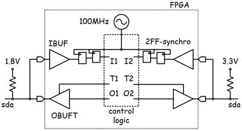
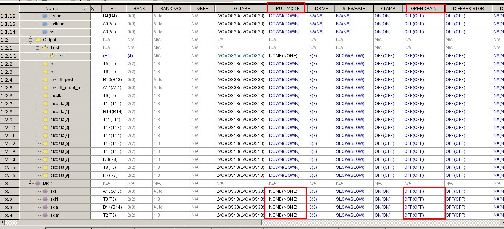

# i2c_bypass_fpga
i2c signal bypass fpga

"master" branch: bidirection scl

"master_to_slave" branch: scl single direction from master to salve

input clock should be much bigger than 400kHz/1MHz, such as 100MHz.

-----------------------update-------------------------------

tested on lattice XO3 working clk 64MHz， 

io settings： No pull up/down，open-drain off.
 
external pull-up both 1.8v/3.3v side are 10k Ohm

